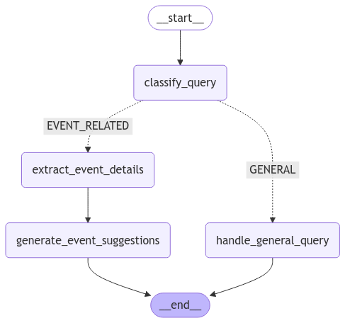
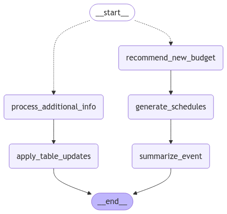
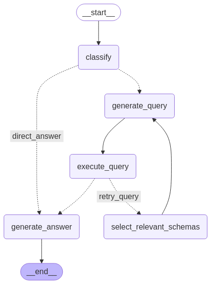

# PlanZ: Multi-Agent Event Planning System

PlanZ is an AI-powered event planning system that uses multiple specialized agents to help users plan, organize, and manage events efficiently. This system leverages large language models through LangChain and LangGraph to create intelligent workflows that handle various aspects of event planning.

## System Architecture

PlanZ uses a multi-agent architecture where specialized AI agents handle different aspects of event planning:

```
┌─────────────────┐    ┌────────────────┐    ┌──────────────────┐    ┌──────────────────┐
│ Event Suggester │    │ Event Planner  │    │ Event Database   │    │ Utility Tools    │
│                 │    │                │    │                  │    │                  │
│ Suggests events │    │ Creates task   │    │ SQL-powered      │    │ - Budget         │
│ based on user   │    │ schedules and  │    │ chatbot for      │    │   categorization │
│ requirements    │    │ budgets        │    │ answering        │    │ - Dependency     │
└────────┬────────┘    └───────┬────────┘    │ project questions│    │   detection      │
         │                     │             └────────┬─────────┘    │ - Task           │
         │                     │                      │              │   descriptions   │
         └─────────┬───────────┴──────────┬───────────┘              └──────────┬───────┘
                   │                      │                                     │
                   │                      │                                     │
         ┌─────────▼──────────────────────▼─────────────────────────────────────▼──────┐
         │                                  FastAPI                                    │
         │                                                                             │
         │                    API endpoints for accessing the agents                   │
         └─────────────────────────────────────────────────────────────────────────────┘
```

## Core Components

### 1. Event Suggester
Analyzes user requirements and suggests appropriate event types and details.

**Main Features:**
- Classifies user queries as general or event-related
- Extracts event requirements (budget, guests, theme, etc.)
- Generates event suggestions for unspecified details



### 2. Event Planner
Creates detailed event schedules with tasks, timelines, and budgets.

**Main Features:**
- Generates task schedules for before, during, and after the event
- Recommends budgets based on event details
- Updates existing schedules with additional information
- Summarizes events with appropriate categorization



### 3. Event Database
A SQL-powered chatbot that answers questions about events stored in the database.

**Main Features:**
- Classifies question types (general, budget, task, milestone, non-project)
- Generates and executes SQL queries based on user questions
- Provides natural language answers based on query results
- Handles error cases and provides clarifications when needed



### 4. Utility Tools
Specialized tools for specific event planning tasks:

- **Budget Categorizer**: Assigns budget categories to tasks
- **Dependency Detector**: Identifies dependencies between tasks
- **Description Generator**: Creates detailed task descriptions
- **Weekly Reporter**: Generates progress reports for projects

## API Endpoints

The system exposes the following FastAPI endpoints:

| Method | Endpoint           | Description                                         |
|--------|--------------------|-----------------------------------------------------|
| GET    | `/healthcheck`     | Verifies system is operational                      |
| POST   | `/chat`            | General chat interface for event planning assistance|
| POST   | `/report`          | Generates reports based on project data             |
| POST   | `/try`             | Suggests event types and details                    |
| POST   | `/schedule`        | Creates detailed event schedules with tasks/budgets |
| POST   | `/description`     | Generates detailed task descriptions                |
| POST   | `/dependency`      | Identifies dependencies between tasks               |
| POST   | `/budget_category` | Categorizes tasks into budget categories            |


## Folder Structure

```
planz-multi-agent/
├── app.py                      # Main FastAPI application
├── modules/
│   ├── routers/               # API route definitions
│   │   ├── models.py          # Expected input format
│   │   ├── chat_router.py     # Include /chat and /report APIs
│   │   └── trial_router.py    # Include /try, /schedule and /description, /dependency, /budget_category APIs
│   └── services/
│       ├── common/   # Shared utilities to merge examler for few-shot learning
│       ├── chain/    # Summarize agents
│       ├── graphs/
│       │   ├── event_database/   # Database query agent
│       │   ├── event_schedule/   # Schedule planning agent
│       │   └── event_suggestion/ # Event suggestion agent
│       └── tools/
│           ├── budget_category/  # Budget categorization
│           ├── dependency/       # Task dependency detection
│           ├── task_description/ # Task description generation
│           └── weekly_report/    # Weekly report generation
├── utils/                     # Utility functions
│   ├── config.py              # Configuration management
│   ├── config.yml             # Configuration file
│   └── settings.py            # Application settings
└── requirements.txt           # Python dependencies
```

## Requirements

- Python 3.11+
- OpenAI API key
- MySQL database
- Dependencies listed in requirements.txt

## Environment Variables

The following environment variables are required:
- `OPENAI_API_KEY`: Your OpenAI API key
- `PLANZ_HOST`: Database host
- `PLANZ_PORT`: Database port
- `PLANZ_USER`: Database username
- `PLANZ_DATABASE`: Database name
- `PLANZ_PASSWORD`: Database password

## Getting Started

1. Clone the repository
2. Install dependencies with `pip install -r requirements.txt`
3. Set up environment variables in a `.env` file
4. Start the application:
   ```
   python app.py
   ```
   
Or use Docker:
```
docker build -t planz-multi-agent .
docker run -p 8000:8000 planz-multi-agent
```

## API Examples

1. **Event Suggestion**:
   ```python
   response = client.post("/try", json={
       "conversation_id": "user123",
       "message": "Plan a baby shower to celebrate the upcoming birth of a baby, expected attendance of 20-40 guests. The event will take place at home on march 25, 2025 plasting a few hours"
   })
   ```

2. **Event Schedule Generation**:
   ```python
   response = client.post("//schedule", json={
       "conversation_id": "user123",
       "message":  "{\"What is the purpose of your event?\": \"Birthday party\", \"When do you need the event to be organized by?\": \"April 25, 2025\", \"Preferred time\": \"Evening\", \"Where would you like to hold the event?\": \"Outdoor venue\", \"What is the anticipated attendance? \": 20, \"What is your budget for the event?\": \"$500\", \"Do you have a theme or decor in mind?\": \"Classic white\", \"What kind of activities or entertainment are you planning?\": \"Live music\"}"
   })
   ```

3. **Event Database Queries**:
   ```python
   response = client.post("/chat", json={
       "conversation_id": "user123",
       "project_id": "1",
       "user_id": 66,
       "workspace_link": "https://testing.com/",
       "message": "Show me all tasks that are currently in progress"
   })
   ```

4. **Task Description Generation**:
   ```python
   response = client.post("/description", json={
       "table_before_event_day": "[\"Venue scouting and selection\", \"Finalize venue booking\"]",
       "table_on_the_event_day": "[\"Venue setup\", \"Vendor coordination\", \"Guest reception and assistance\"]",
       "table_after_the_event_day": "[\"Equipment return\", \"Event review\"]"
   })
   ```

5. **Budget Category Assignment**:
   ```python
   response = client.post("/budget_category", json={
       "message": ["Venue scouting and selection", "Live music booking", "Catering arrangement", "Decor and theme design", "Photography and videography"]
   })
   ```

6. **Task Dependency Detection**:
   ```python
   response = client.post("/dependency", json={
       "message": ["Venue scouting and selection", "Finalize venue booking", "Guest list preparation", "Catering arrangement", "Equipment rental", "Vendor confirmation"]
   })
   ```
   